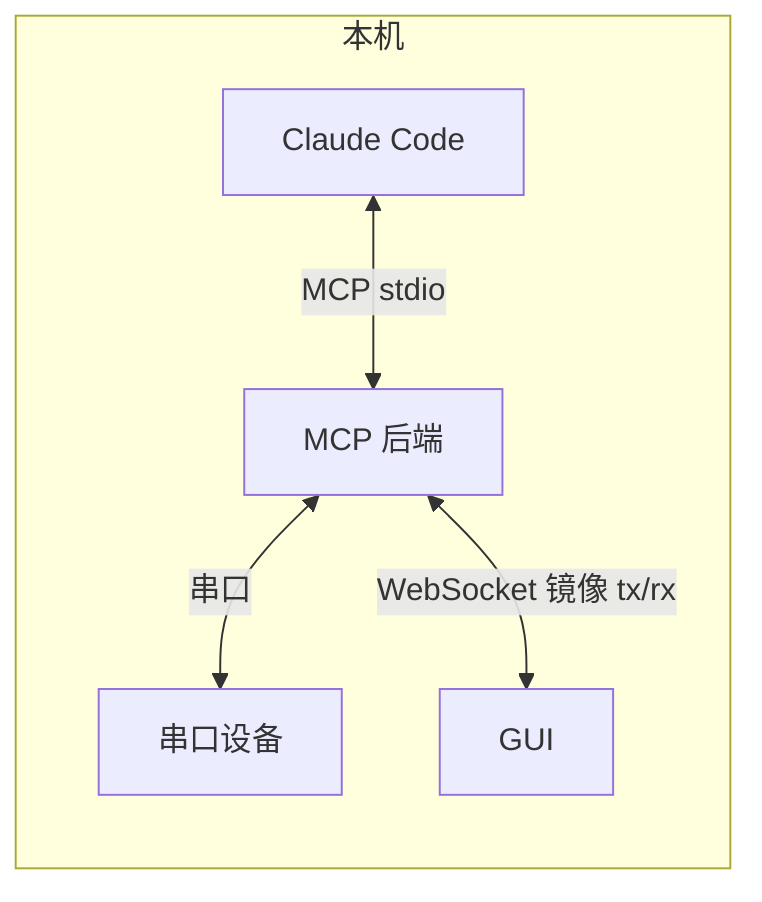
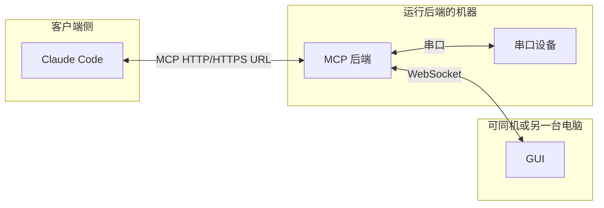

# Serial MCP 文档总览

**语言：** **中文** · [English](docs/README_en.md)

本目录为 **Serial MCP Server** 的终端用户说明：如何在各系统上安装、用 GUI 配置 Claude MCP，以及通过命令行或环境变量做补充配置。

## 各平台使用说明

| 语言 | Windows | Ubuntu / Linux |
|------|---------|----------------|
| 中文 | [usage_windows_zh-CN.md](docs/usage_windows_zh-CN.md) | [usage_ubuntu_zh-CN.md](docs/usage_ubuntu_zh-CN.md) |
| English | [usage_windows_en.md](docs/usage_windows_en.md) | [usage_ubuntu_en.md](docs/usage_ubuntu_en.md) |

---

## 环境搭建示意图

系统中有三类角色，可按你的实际机器拆分或合并到同一台电脑上：

| 角色 | 作用 |
|------|------|
| **MCP 后端**（`serial-mcp-cpp`） | 提供 MCP 协议与串口读写；对外暴露 **WebSocket** 服务，用于把串口收发镜像给 GUI。 |
| **Claude Code（或其它 MCP 客户端）** | 通过 **stdio** 或 **http** 调用 MCP 工具（如 `serial_write` / `serial_read`）。 |
| **GUI**（`serial_mcp_gui`） | 仅通过 **WebSocket** 订阅后端的收发数据，在界面中**输出**日志与流量；也可经 WS 向串口写入。 |

### stdio 模式（本机常见）

后端通常由 Claude 直接拉起；GUI 若与后端同机，WebSocket 多为本机地址。

### http 模式（远程 MCP）

客户端与后端可不在同一台机器；GUI 仍只依赖 **与后端之间的 WebSocket**，与 MCP 走 HTTP 还是本机 stdio 无冲突。

---

## GUI 通过 WebSocket 远程连接后端（跨环境）

- **不限定操作系统组合**：后端可以跑在 Windows 或 Ubuntu/Linux，GUI 可以跑在另一套系统上（例如后端在工控机 Ubuntu，GUI 在办公机 Windows），只要 **网络可达** 且 **防火墙放行 WebSocket 端口**（默认常为 `8765`，以后端实际配置为准）。
- **数据输出**：GUI 作为 **观察者**：连接成功后，会显示后端推送的串口收发数据（`serial_rx` / `serial_tx` 等镜像内容），便于调试与监视；与 MCP 客户端是否在同一台机器无关。
- **如何指向远程后端**：在 GUI 的 WebSocket 设置中填写后端的 **主机名或 IP + 端口**（例如 `ws://192.168.1.10:8765`），或使用启动参数（若你的发行版支持）指定 WebSocket URL，使 GUI 不再默认连 `127.0.0.1`。

后端侧需监听 **可被远程访问的地址**（例如将 `SERIAL_MCP_WS_HOST` 设为 `0.0.0.0` 或具体网卡 IP，具体见各平台使用说明中的环境变量与 GUI 配置项），否则只能本机连接。
