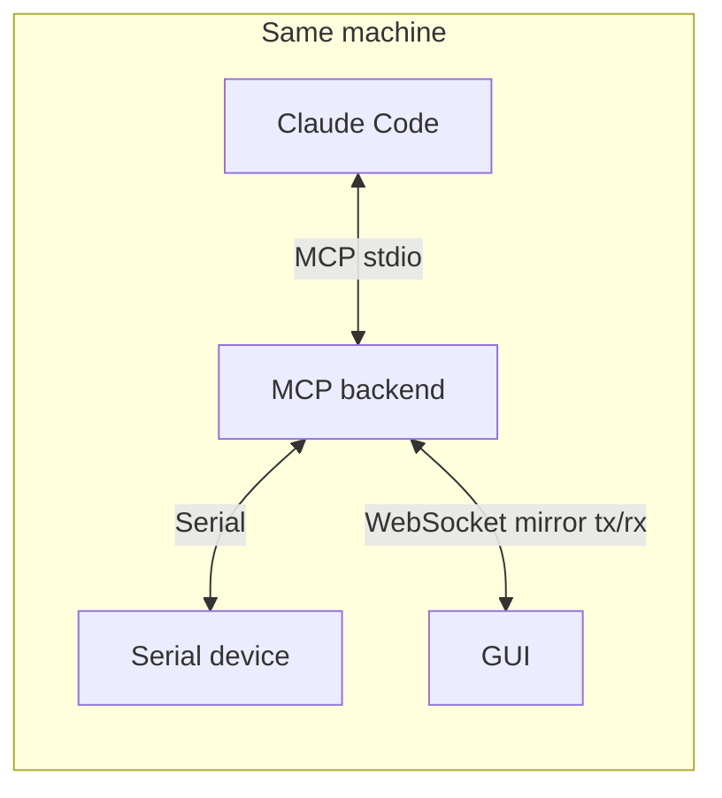
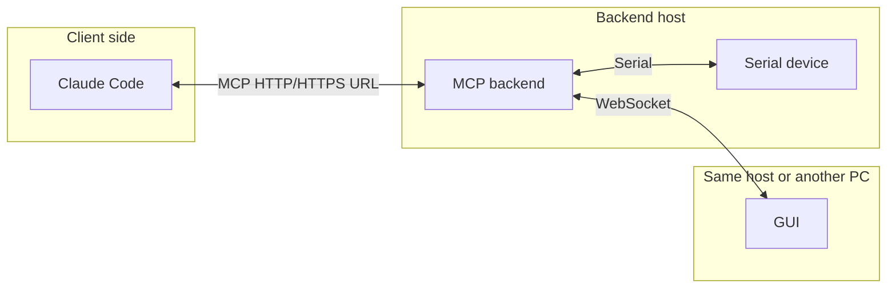

# Serial MCP Documentation (English)

**Languages:** [中文](README.md) · **English**

This folder contains **end-user** documentation for **Serial MCP Server**: how to install on each platform, configure Claude MCP with the GUI, and optionally use the command line or environment variables.

## Platform guides

| Language | Windows | Ubuntu / Linux |
|----------|---------|----------------|
| 中文 | [usage_windows_zh-CN.md](usage_windows_zh-CN.md) | [usage_ubuntu_zh-CN.md](usage_ubuntu_zh-CN.md) |
| English | [usage_windows_en.md](usage_windows_en.md) | [usage_ubuntu_en.md](usage_ubuntu_en.md) |

---

## Deployment overview

There are three roles; you can run them on one machine or split them across several:

| Role | Purpose |
|------|---------|
| **MCP backend** (`serial-mcp-cpp`) | Implements MCP and serial I/O; exposes a **WebSocket** service that mirrors traffic to the GUI. |
| **Claude Code (or another MCP client)** | Talks MCP over **stdio** or **http** (e.g. `serial_write` / `serial_read`). |
| **GUI** (`serial_mcp_gui`) | Subscribes to the backend **only via WebSocket** to **show** logs and traffic; can also send writes over WS. |

### stdio mode (typical on one machine)

The backend is often started by Claude. If the GUI runs on the same host, the WebSocket URL is usually localhost.

### http mode (remote MCP)

The client and backend may be on different machines. The GUI still depends **only on WebSocket to the backend**; that is independent of whether MCP uses HTTP or local stdio.

---

## Remote GUI over WebSocket (cross-platform)

- **No fixed OS pairing**: the backend can run on Windows or Ubuntu/Linux, and the GUI on another OS (e.g. backend on an Ubuntu industrial PC, GUI on a Windows laptop) as long as the **network path works** and the **WebSocket port is open** in the firewall (often `8765` by default—follow your backend settings).
- **Data output**: the GUI acts as an **observer**: after it connects, it shows serial traffic pushed by the backend (`serial_rx` / `serial_tx` and related mirror data) for debugging and monitoring, regardless of where the MCP client runs.
- **Pointing at a remote backend**: set the GUI’s WebSocket target to the backend’s **hostname or IP + port** (e.g. `ws://192.168.1.10:8765`), or use a launch flag if your build supports it, so the GUI does not stay on `127.0.0.1`.

On the backend, listen on an **address reachable from the network** (e.g. set `SERIAL_MCP_WS_HOST` to `0.0.0.0` or a specific interface IP—see the per-platform guides for env vars and GUI fields). Otherwise only local connections work.
